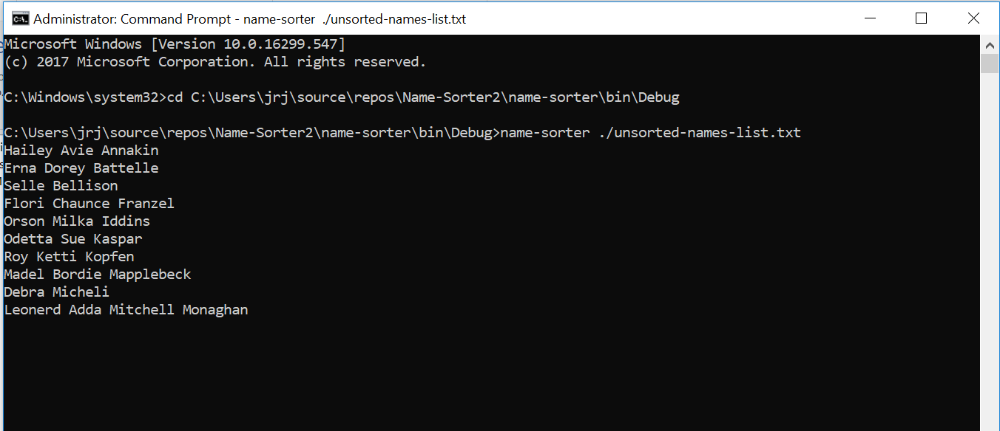
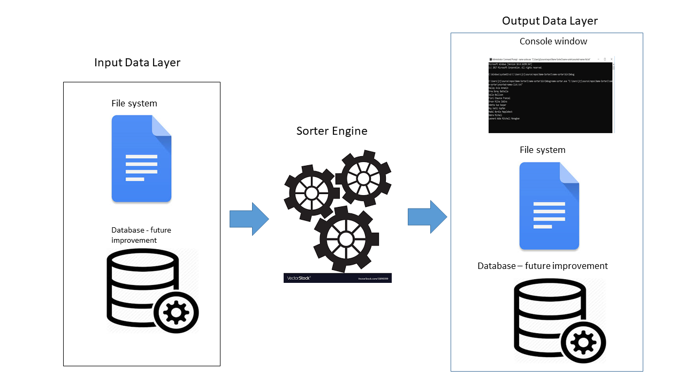
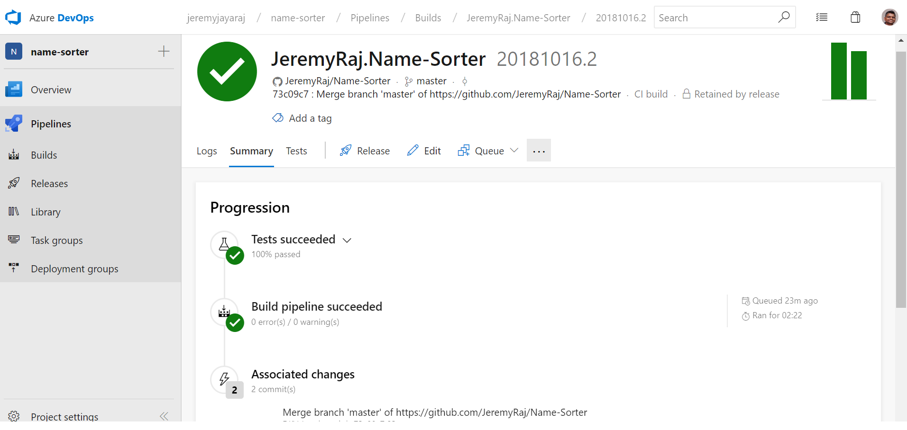
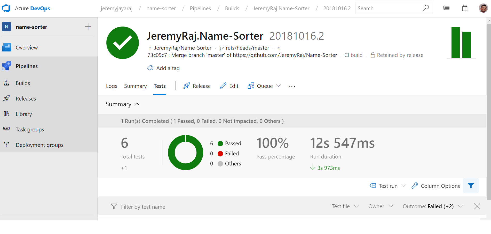
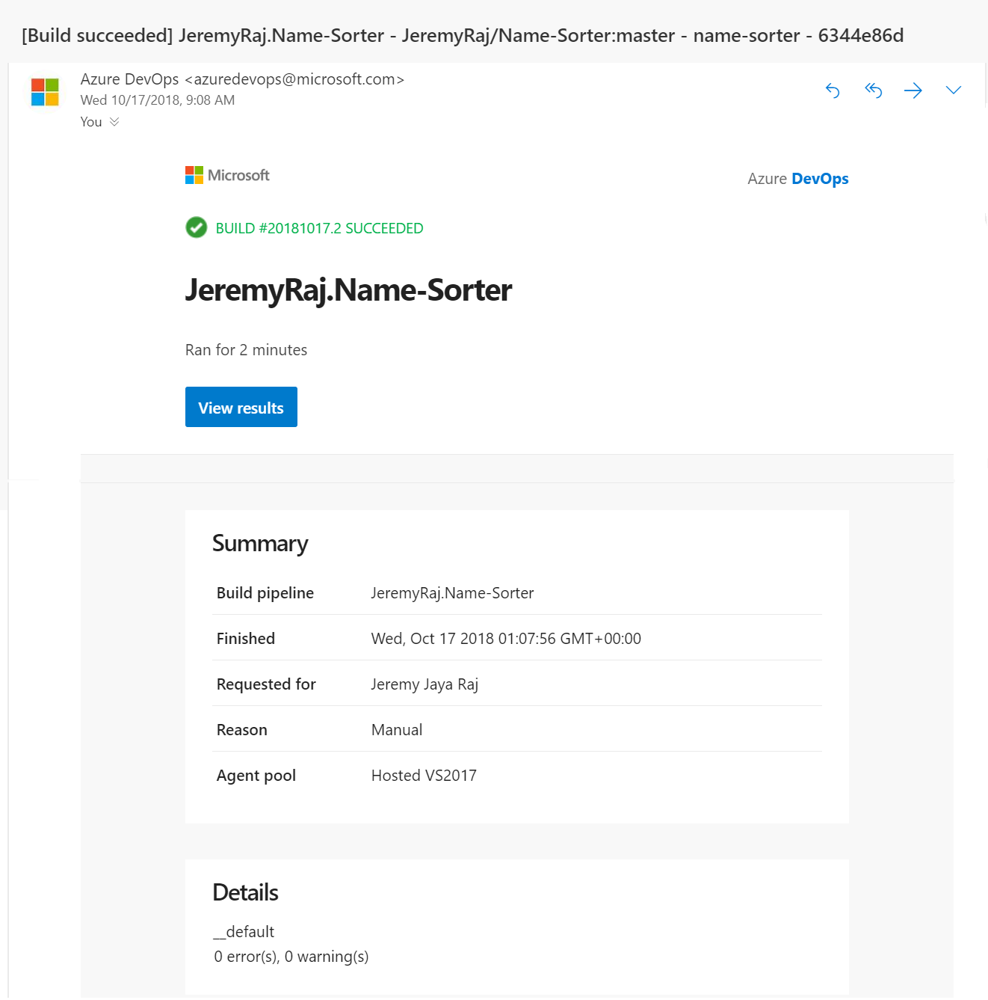

# Name-Sorter
Given a set of names, the app orders the set first by last name, then by any given names the person may have. A name must have at least 1 given name and may have up to 3 given names.

# Getting Started
To run the console application, clone the repository.  Run name-sorter.exe in Command Prompt  
`eg: name-sorter ./unsorted-names-list.txt`  
`Note: Please ensure the unsorted-names-list.txt file exist in the working directory`

Results will be saved in sorted-names-list.txt in the working directory.

# Framework and Nuget packages
- Visual Studio 2017 .NET Framework 4.6.1
- CuttingEdge.Conditions
- Newtonsoft.Json
- FluentAssertions
- NUnit
- NSUbstitute

# High Level Architecture

The core of the system is the sorter Engine. It reads data from the file, executes the sorting routine and outputs the sorted data to the console window and file.

# Build & CI - Azure DevOps

Test results shown in Azure DevOps portal

Email notification for successful build

# Future Improvements
- Add new data readers.Create new DBReader class and implement IDataReader. Eg: database table
- Add new data writer. Create new DBWriter class and implement IDataWriter Eg: write to database.
- Add new DBWriter to OutputFactory (GetWriters() method) to write to DB.
- Add logging service
- Add more unit tests.

# Authors
Jeremy Jaya Raj  
LinkedIn: https://www.linkedin.com/in/jeremyjayaraj/  
Email: jeremy.jayaraj@outlook.com
