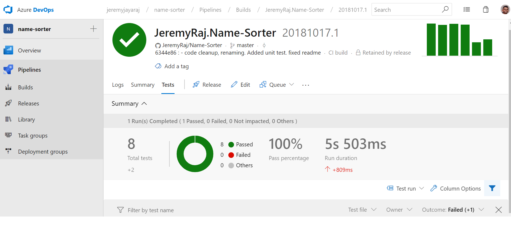

# Name-Sorter
Given a set of names, the app order the set first by last name, then by any given names the person may have. A name must have at least 1 given name and may have up to 3 given names.

# Getting Started
To run the console application, clone the repository.  Run name-sorter.exe in Command Prompt
Eg: name-sorter.exe "path to your unsorted list"

Results will be saved in sorted-names-list.txt in parent directory

# Framework and Nuget packages used
- Visual Studio 2017 .NET Framework 4.6.1
- CuttingEdge.Conditions
- Newtonsoft.Json
- FluentAssertions
- NUnit
- NSUbstitute

# Build & CI - Azure DevOps
Build shown in Azure DevOps portal
S
Test results shown in Azure DevOps portal

Authors
Jeremy Jaya Raj
